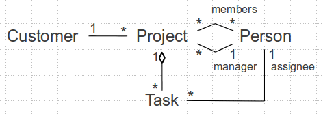
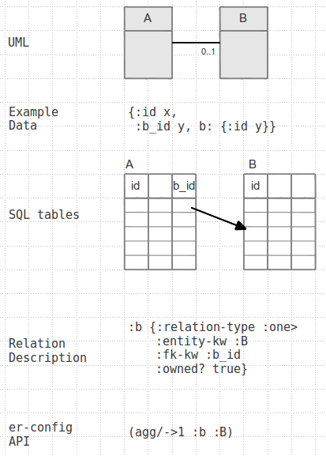
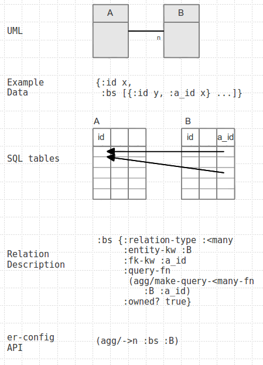
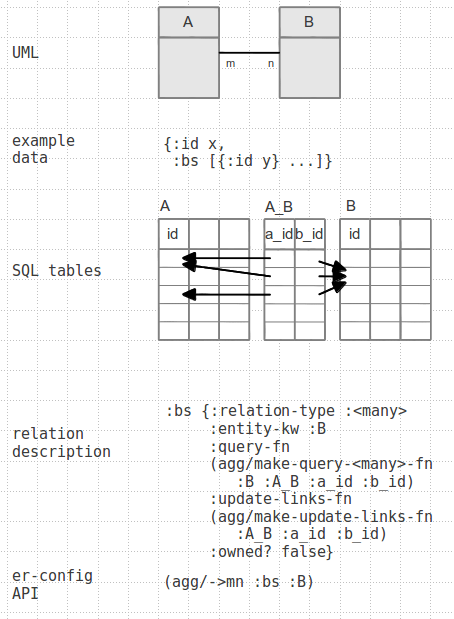

# aggregate

Handle SQL persistence for nested datastructures.

The name 'aggregate' stems from Eric Evans book
[Domain Driven Design](http://domainlanguage.com/ddd/patterns/).
Martin Fowler briefly explains
[what is meant by the term Aggregate](http://martinfowler.com/bliki/DDD_Aggregate.html).

[](https://travis-ci.org/friemen/aggregate)

The library is currently work in progress and not yet released!

## Motivation

Have you ever tried to persist a data graph like this
```clojure
(def project
  {:name "Learning Clojure"
   :tasks [{:desc "Buy a book"}
           {:desc "Install Java"}
           {:desc "Install Emacs"}
           {:desc "Hack!"}]
   :manager {:name "Daisy"})
```
to tables of a relational DB?

Not a big deal... unless you have to write similar DB access code over
and over again for your whole set of domain objects. This library will
do the hard work for you after you have provided some meta data about
the relations between database tables.

Besides being helpful for persisting complex data in relational tables
it is meant to be composable with SQL-oriented libraries like
[Yesql](https://github.com/krisajenkins/yesql),
[HoneySQL](https://github.com/jkk/honeysql) or plain
[clojure.java.jdbc](https://github.com/clojure/java.jdbc) in two ways.
First, you can use aggregate `load`, `save!` and `delete!` only for
those cases where you have nested data, and use functions based on
other libraries for unnested data. Second, you can exchange the
default DB access functions that aggregate provides with your own
implementations based on other libraries.


## A first impression

Include this in your namespace declaration:
```clojure
[aggregate.core :as agg]
```

Or for testing in the REPL execute
```clojure
(do (require '[aggregate.core :as agg])
    (require '[aggregate.testsupport :refer :all]))
```


The library mainly provides three functions

* `(agg/load er-config db-spec entity-keyword id)` or `(agg/load er-config db-spec data)`
* `(agg/save! er-config db-spec entity-keyword data)` or `(agg/save! er-config db-spec data)`
* `(agg/delete! er-config db-spec entity-keyword data)` or `(agg/delete! er-config db-spec data)`


The `er-config` describes *relations* between *entities*, and contains
functions that actually read, insert, update or delete records. The
`db-spec` is exactly what is described in
[get-connection](http://clojure.github.io/java.jdbc/#clojure.java.jdbc/get-connection).

Here's an example with a bunch of tables and their relations:



The corresponding schema definition looks like this
```clojure
(def schema
  [:customer [(id-column)
              [:name "varchar(30)"]]
   :person [(id-column)
            [:name "varchar(30)"]]
   :project [(id-column)
             [:name "varchar(30)"]
             (fk-column :person :manager_id false)
             (fk-column :customer false)]
   :task [(id-column)
          [:desc "varchar(50)"]
          [:effort "integer"]
          (fk-column :project false)
          (fk-column :person :assignee_id false)]
   :person_project [(fk-column :project false)
                    (fk-column :person false)]])
```

The ids are auto generated integers, and the foreign keys establish
referential integriy. Please note that schema definition / evolution
is out of aggregate's scope, and just included for testing purposes.

What follows is a global er-config that enables `load`, `save!` and
`delete!` to take the relationships into account.

```clojure
(def er
  "The complete entity-relationship model.
  Be careful, using this directly may take the complete database into account."
  (agg/make-er-config
   (agg/entity :customer {}
               (agg/->n :projects :project {:fk-kw :customer_id}))
   (agg/entity :person {}
               (agg/->n :tasks :task {:fk-kw :assignee_id
                                      :owned? false})
               (agg/->n :projects_as_manager :project {:fk-kw :manager_id
                                                       :owned? false})
               (agg/->mn :projects_as_member :project))
   (agg/entity :project {}
               (agg/->1 :customer :customer {:owned? false})
               (agg/->mn :members :person {:query-fn (agg/make-query-<many>-fn
                                                      :person
                                                      :person_project
                                                      :project_id
                                                      :person_id)
                                           :update-links-fn (agg/make-update-links-fn
                                                             :person_project
                                                             :project_id
                                                             :person_id)})
               (agg/->1 :manager :person {:owned? false})
               (agg/->n :tasks :task {:fk-kw :project_id}))
   (agg/entity :task {}
               (agg/->1 :project :project {:owned? false})
               (agg/->1 :assignee :person {:owned? false}))))
```

You can see that the library provides factories that create default DB
access functions based on core.java.jdbc. But you can use any other
functions that comply to the contract. Where you don't specify your own
function a default is provided.

The er-config above is complete, but it's dangerous because any
operation on a project might affect surprisingly large chunks of
data. So in order to just take the necessary relationships into
account we can narrow the er-config down to support certain use cases.

```clojure
(def manage-person-to-project-er
  (-> er (agg/only [:person]
                   [:project :members :manager])))

(def manage-task-to-person-er
  "Supports task-to-person assignment, cutting off project related links."
  (-> er (agg/without [:task :project]
                      [:person :projects_as_member :projects_as_manager])))
```


This is all we need as preparation. Let's test it.
As a test scoped dependency H2 is available:

```clojure
(do (require '[aggregate.h2 :as h2])
    (h2/start-db))
; "Starting DB, web console is available on localhost:8082"
;= nil
```

Setup a schema

```clojure
(create-schema! @h2/db-con schema)
;= [0]
```

A `save!` could look like this:
```clojure
(def project (agg/save! er @h2/db-con :project
                                   {:name "Learning Clojure"
                                    :customer {:name "Big Company"}
                                    :tasks [{:desc "Buy a good book" :effort 1}
                                            {:desc "Install Java" :effort 2}
                                            {:desc "Configure Emacs" :effort 4}]
                                    :members [{:name "Daisy"}
                                              {:name "Mini"}]
                                    :manager {:name "Daisy"}}))
;= #'user/project									
(clojure.pprint/pprint project)
; {:aggregate.core/entity :project,
;  :id 2,
;  :name "Learning Clojure",
;  :manager_id 1,
;  :manager
;  {:name "Daisy", :tasks [], :aggregate.core/entity :person, :id 1},
;  :customer_id 1,
;  :customer
;  {:name "Big Company", :aggregate.core/entity :customer, :id 1},
;  :tasks
;  [{:desc "Buy a good book",
;    :effort 1,
;    :aggregate.core/entity :task,
;    :id 1}
;   {:desc "Install Java",
;    :effort 2,
;    :aggregate.core/entity :task,
;    :id 2}
;   {:desc "Configure Emacs",
;    :effort 4,
;    :aggregate.core/entity :task,
;    :id 3}],
;  :members
;  [{:name "Daisy", :tasks [], :aggregate.core/entity :person, :id 2}
;   {:name "Mini", :tasks [], :aggregate.core/entity :person, :id 3}]}
;= nil
```

We can easily inspect a table to check what has happened:
```clojure
(dump-table @h2/db-con :person_project [[:person_id 10] [:project_id 10]])
; person_id |project_id
; ----------|----------
; 2         |2
; 3         |2
;= nil
```

We can load a single task, without materializing it's project by using the narrowed er-config:
```clojure
(agg/load manage-task-to-person-er @h2/db-con :task 1)
;= {:aggregate.core/entity :task,
;   :id 1,
;   :project_id 2,
;   :effort 1,
;	:desc "Buy a good book"}
```

And we can delete the project, and with it all it's owned entities and links to it:

```clojure
(agg/delete! er @h2/db-con :project project)
;= 4
```

## Entity-Relation Configuration

The er-config is only a map of the form

```
{<entity-kw> {:fns {}
              :relations {<relation-kw> {}}}}
```

Each entity is represented by it's entity-kw and a corresponding
map. Each of these entity maps contains general options, for example
the functions in :fns to be used for read, insert, update and delete,
and a map of relations.

Each relation consists of it's relation keyword, as it is used in
concrete data, and options. The options depend on the type of the
relation. The mandatory `:relation-type` must have one of the values
`:one>`, `:<many` or `:<many>`. The other mandatory entry is the
`:entity-kw` which points to another entity in the er-config.

You can concisely create an er-config map using `(agg/make-er-config
entities)`. An entity is created by `(agg/entity entity-kw options-map
relations)`. A relation is created with one of three functions, whose
names denote the type of the relation.

The following sections show how to specify a relation of a certain type.

### Relation type :one>



You define a *to-one* relationship using
`(agg/->1 <relation-kw> <entity-kw> <options-map>?)`.

Optional values within options-map are
* `:fk-kw` A keyword specifying the column name of the foreign key
  column whose value points to a record in the other table. Default value
  is `<relation-kw>_id`.
* `:owned?` A boolean, true by default. Signals if records reachable
  through this relation are considered a part, i.e. if the whole is
  deleted the parts vanish, and if the whole no longer references a
  part it will also vanish.

### Relation type :<many



You define a *to-many* relationship using
`(agg/->n <relation-kw> <entity-kw> <options-map>?)`.

Optional values within options-map are
* `:fk-kw` A keyword specifying column name of the the other tables
  foreign key column whose values point to a record in this entity's
  table. Default value is `:owner_id`.
* `:query-fn` A function `(fn [db-spec fk-id])` returning the sequence
  of linked records. Defaults to `(make-query-<many-fn entity-kw fk-kw)`.
* `:owned?` A boolean, true by default. Signals if records reachable
  through this relation are considered a part, i.e. if the whole is
  deleted the parts vanish, and if the whole no longer references a
  part it will also vanish.

### Relation type :<many>



You define a *many-to-many* relationship with a link table using
`(agg/->mn <relation-kw> <entity-kw> <options-map>?)`.

Optional values within options-map are
* `:query-fn` A function `(fn [db-spec fk-id])` returning the sequence
  of linked records. Defaults to `(make-query-<many>-fn entity-kw
  (default-link-tablename parent-entity-kw entity-kw) fk-a-kw
  fk-b-kw)`.
* `:update-links-fn` A function `(fn [db-spec a-id bs])` that takes
  this records id and a sequence of saved records and inserts all link
  records in a link table. Defaults to `(make-update-links-fn
  (default-link-tablename parent-entity-kw entity-kw) fk-a-kw
  fk-b-kw)`.
* `:owned?` A boolean, false by default. Signals if records reachable
  through this relation are considered a part, i.e. if the whole is
  deleted the parts vanish, and if the whole no longer references a
  part it will also vanish.

## How does it work?

`load`, `save!` and `delete!` are complex, recursive operations whose
effects are not easy to anticipate. The following sections explain
what each of the functions does.

### load

`(agg/load er-config db-spec entity-keyword id)`

`(agg/load er-config db-spec data)`

`load` can be used with an entity keyword and an id, or a preloaded data
map containing the entity keyword in the slot `::agg/entity`.

It iterates all relations that can be found in the er-config relations
map for the entity and recursively loads the data of connected
rows. Loaded maps are augmented with a corresponding entity keyword in
the `::agg/entity` slot.


### save!

`(agg/save! er-config db-spec entity-keyword data)`

`(agg/save! er-config db-spec data)`

`save!` either takes an entity keyword and the data, or only the data
containing the entity keyword in `::agg/entity`.

To take foreign key constraints into account it will first recursively
save all nested data of `->1` relations, because the resulting ids
will be included in the current record. If a nested map is missing,
although it's foreign key value is present then the foreign key value
is nilled. If the relation is `owned?` then the record itself is
deleted from the database.

Then it actually inserts or updates the current record, depending
whether the record has an :id value set or not.

Afterwards all records reachable through `->n` and `->mn` relations
(which might need the id of the current record as value for a foreign
key) are saved. It queries the database to detect orphans. In an
`owned?` relation all records NOT contained in the nested vector will
be deleted from the database. In non-owned relations the orphans will
be updated, in case of a `->n` relation by nilling the foreign key
value pointing to the current record, in case of a `->mn` by removing
the link records from the link table.


### delete!

`(agg/delete! er-config db-spec entity-keyword data)`

`(agg/delete! er-config db-spec data)`

`delete!` either takes an entity keyword and the data, or only the data
containing the entity keyword in `::agg/entity`.

To take the foreign key constraints into account it will first
recursively delete all records reachable through owned `->n` and
`->mn` relations to make sure those don't contain foreign keys to the
current record. In the non-owned cases only the foreign keys will be
nilled and the link records will be removed, respectively.

Then the current record is deleted from the database.

Afterwards all records reachable through `->1` relations that the
current record pointed to are recursively deleted.

`delete!` can only work this way for those records whose data is
actually loaded. If you only provide an id to `delete!` it will just
delete the record, but doesn't delete related records. If, however,
you just want to delete by id and don't want to load data to traverse
the whole graph, DB level "cascade on delete" might be an option to look
at.


## Custom DB access functions

The functions `load`, `save!` and `delete!` don't access the DB directly,
instead they rely on a set of functions that are defined within the
er-config. Although `make-er-config` provides default implementations,
it is perfectly reasonable to use your own functions if you have
particular requirements. If you are curious about the defaults you
should open the [core namespace](src/aggregate/core.clj) and search
for the `make-*-fn` functions.


### Entity level functions

These functions are provided in the entity options map. Example:

```clojure
(agg/entity :person
            {:fns {:read my-read-person
                   :insert my-insert-person
                   :update my-update-person
				   :delete my-delete-person}}
	        (agg/-> ...)
			...)
```

As you can see four functions are expected: read, insert, update and delete.


`(fn read [db-spec id])` takes a db-spec and the value for the primary
key and reads exactly one row.  It returns a map with row data, or nil if
the row doesn't exist.


`(fn insert [db-spec row-map])` takes a db-spec and a map with row
data, insert the row into the DB and returns the row-map augmented
with a :id value.


`(fn update [db-spec set-map])` takes a db-spec and a map with keys
and values to set, and updates the row in the DB and returns the
set-map.


`(fn delete [db-spec id])` takes a db-spec and the value for the
primary key and deletes exactly one row. Returns nil if the record was
not deleted, else returns 1.


### Relation level functions

These functions are provided in the relation options map. Example:

```clojure
(agg/->mn :members :person {:query-fn query-project-members
                            :update-links-fn update-member-links})
```

Please note that, depending on the type of relation (either `->n` or
`->mn`), the query-fn slot requires fundamentally different
implementations. The former needs to do a simple select by a foreign
key, the second needs to select on a join of the link table with the
requested entity table.

In case of a 1-to-n (or `->n`) relation only query-fn must be present,
in case of a n-to-m (or `->mn`) relation realized over a link table
both, query-fn and update-links-fn, must be present.


`(fn query-by-fk [db-spec fk-id])` takes a db-spec and a value for a
foreign key and returns a sequence of all rows containing the fk-id.


`(fn update-links [db-spec a-id bs])` takes a db-spec, the value for a
foreign key a-id and all rows that are linked to the entity identified
by a-id and inserts all link-rows into the link table.


## License

Copyright © 2014 F.Riemenschneider

Distributed under the Eclipse Public License 1.0.
